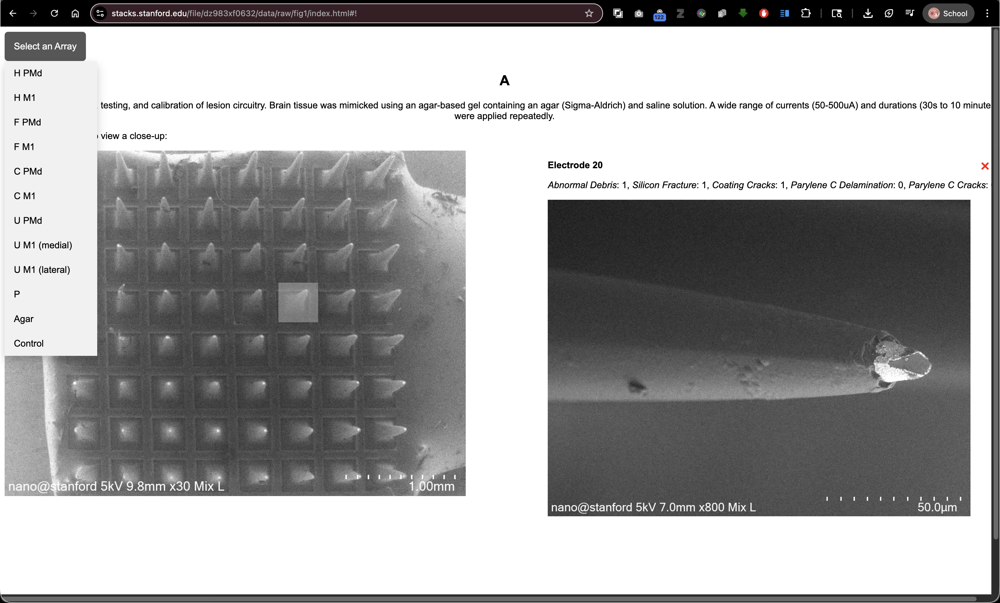
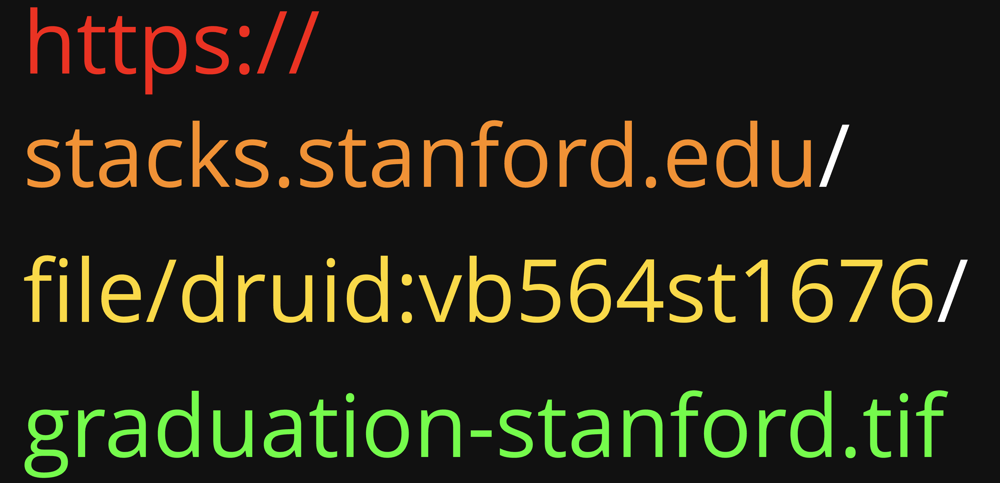

# Hacking Stanford Libraries: Building Interactive Web Applications with SDR

## Workshop Introduction

* This workshop's URL: [https://stanfordgeospatialcenter.github.io/hacking-stanford-libraries](https://stanfordgeospatialcenter.github.io/hacking-stanford-libraries)
* The Github Repo: [https://github.com/StanfordGeospatialCenter/hacking-stanford-libraries](https://github.com/StanfordGeospatialCenter/hacking-stanford-libraries)
* The Slides: [https://slides.com/staceymaples/hacksdr_app](https://slides.com/staceymaples/hacksdr_app)
* The DEMO Repo to FORK for your own use: [https://github.com/StanfordGeospatialCenter/Hacking_SDR_Demo_App](https://github.com/StanfordGeospatialCenter/Hacking_SDR_Demo_App)


Welcome to this hands-on workshop on building interactive web applications using the Stanford Digital Repository (SDR) infrastructure!

### Inspiration

This workshop was inspired by extensive experimentation with SDR as a spatial data infrastructure. A key example that motivated this work is [this interactive web application](https://stacks.stanford.edu/file/dz983xf0632/data/raw/fig1/index.html), which is published directly within an [SDR deposit](https://purl.stanford.edu/dz983xf0632).



It beautifully demonstrates that SDR is not just an archive—it's a complete platform for hosting interactive scholarly applications alongside your research data. This workshop teaches you how to create similar applications for your own projects.

## Workshop Objectives

This workshop will teach you how to:

1. **Access and use content from the Stanford Digital Repository (SDR)** directly in your web applications
2. **Build interactive HTML, JavaScript, and CSS applications** that showcase your collection deposits
3. **Leverage the Digital Stacks API** to reference and display materials hosted in SDR
4. **Create user-friendly visualizations** that help users explore and understand your collections
5. **Publish simple HTML documents** alongside your SDR deposits to create custom collection viewers

## What is the Stanford Digital Repository?

The Stanford Digital Repository (SDR) is Stanford's permanent digital preservation repository. When you deposit materials in SDR, they are:

- **Permanently preserved** with long-term storage guarantees
- **Publicly accessible** through the Digital Stacks web service
- **Assigned permanent URLs (PURLs)** that will never change
- **Available for direct linking** from your own applications and websites

## What We'll Build

In this workshop, we'll create a **Stanford Public Art Interactive Map** that:

- Displays artwork locations on an interactive Leaflet map
- Shows a high-resolution aerial photograph from the Digital Stacks
- Integrates data from Wikidata to show images and details about each artwork
- Uses a split-screen layout for easy exploration
- Can be deposited directly into SDR alongside your data


## Prerequisites

**No prior programming experience required!** We'll teach you everything you need to know, starting from the basics.

You will need:

- A text editor (VS Code, Sublime Text, Notepad++, or even Notepad)
- A web browser (Chrome, Firefox, Safari, or Edge)
- The sample files from this workshop repository

## Key Concepts We'll Cover

### 1. File Paths: Relative vs. Absolute

Understanding file paths is crucial for web development, especially when working with the Digital Stacks.

**Absolute Paths** start from the root of a file system or a complete URL:

- `https://stacks.stanford.edu/file/druid:vb564st1676/graduation-stanford.tif`
- `C:\Users\YourName\Documents\project\index.html` (Windows)
- `/Users/YourName/Documents/project/index.html` (Mac/Linux)



**Relative Paths** are relative to the current file's location:

- `./image.jpg` - file in the same directory as the HTML file
- `../data/info.json` - file in a data folder one level up
- `collection/map.geojson` - file in a collection subfolder

**Why This Matters for SDR:**
When you deposit files in SDR, they maintain their folder structure. If you use relative paths in your HTML files, they will continue to work after deposit!

### 2. The Digital Stacks API

The Digital Stacks provides web access to files in SDR using a consistent URL pattern:

```
https://stacks.stanford.edu/file/druid:[DRUID]/[filename]
```

Where:

- `[DRUID]` is the unique identifier for your SDR object (e.g., `vb564st1676`)
- `[filename]` is the name of the file within that object (e.g., `data.geojson`)

**Example:**

```
https://stacks.stanford.edu/file/druid:vb564st1676/graduation-stanford_stanford-california_20240616_171600_ssc2_nrg_flat_50cm_rotated-154_large_COG.tif
```

This URL pattern means:

- Your files are **always accessible** via their DRUID
- URLs are **permanent** and won't break
- You can **reference files from your HTML** using these URLs
- Files can be **accessed by anyone** (if publicly available)

### 3. HTML, CSS, and JavaScript Working Together

Think of building a web application like building a house:

- **HTML (HyperText Markup Language)** is the structure - the walls, floors, and rooms
- **CSS (Cascading Style Sheets)** is the decoration - paint colors, furniture arrangement, lighting
- **JavaScript** is the electricity and plumbing - makes things interactive and dynamic

We'll build our application step by step, showing how each piece works.

## Getting Ready for this Workshop

Since we are building a real web application, we need a place to host it. The Stanford Digital Repository (SDR) is a permanent research repository. We want to treat it with respect and ensure that we only deposit finished, significant scholarly work, rather than temporary files from a workshop.

Fortunately, **GitHub Pages** works in a very similar way to the **SDR Digital Stacks**. Both serve files via HTTP, and if you structure your application using **relative paths**, an application that works on GitHub Pages will work perfectly when deposited into the SDR. This makes GitHub an excellent "staging area" or "testbed" for your SDR deposits.

To get set up, follow these steps:

### 1. Create a GitHub Account

If you don't already have one, sign up for a free account at [github.com](https://github.com).

### 2. Fork and Clone the Workshop Repository

To work along with us, you'll need your own copy of the workshop materials.

1. Go to the [workshop repository on GitHub](https://github.com/StanfordGeospatialCenter/hacking-stanford-libraries).
2. Click the **Fork** button in the top-right corner to create a copy in your own account.
3. Once forked, you can work directly in the browser using GitHub Codespaces, or clone it to your local machine if you are comfortable with Git.

### 3. Create Your Work File

Throughout this workshop, you will be building a single HTML file step-by-step.

1. In the root of your new repository, create a new file named `index.html`.
2. We will paste code into this file as we progress through the steps.
3. By naming it `index.html`, GitHub Pages will automatically serve it as the home page of your site later on.

## Ready to Get Started?

Let's begin with [Step 0: Basic HTML Structure](01-step-00-basic-html.md)!

---

## Additional Resources

- **Digital Stacks Documentation:** https://api.library.stanford.edu/docs/digital-stacks/api/
- **Leaflet Documentation:** https://leafletjs.com/
- **Wikidata API:** https://www.wikidata.org/wiki/Wikidata:Data_access
- **MDN Web Docs (HTML/CSS/JavaScript):** https://developer.mozilla.org/
- **GeoJSON Specification:** https://geojson.org/

---

*This workshop is brought to you by the Stanford Geospatial Center*
