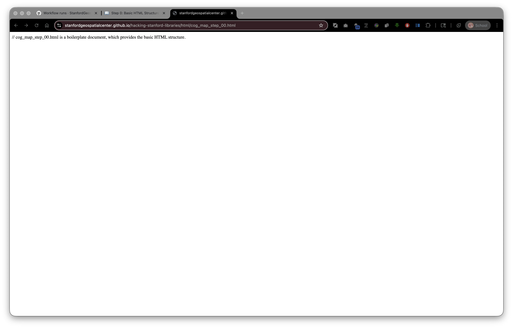

# Step 0: Basic HTML Structure

Live Demo: [html/cog_map_step_00.html](html/cog_map_step_00.html)



## Overview

In this first step, we'll create the most basic HTML document possible. This is the foundation that every web page needs.

## Learning Objectives

- Understand what HTML is and why we need it
- Learn the essential components of an HTML document
- Understand the Document Type Declaration and basic HTML structure

## What is HTML?

HTML (HyperText Markup Language) is the standard language for creating web pages. It's not a programming language - it's a **markup language**, which means it uses **tags** to describe the structure and content of a web page.

Think of HTML tags like labels in a filing system - they tell the browser "this is a heading," "this is a paragraph," "this is an image," etc.

## Understanding File Paths

Before we begin, let's understand where files are located:

### Your Project Structure

When you download this workshop, your files are organized like this:

```
hacking-stanford-libraries/
├── stanford_campus.geojson
├── stanford_public_art.geojson
├── stanford_campus_irg.tif
├── html/
│   ├── cog_map_step_00.html
│   ├── cog_map_step_01.html
│   ├── ...
│   ├── styles_wikidata.css
│   └── lib/
│       ├── leaflet.js
│       ├── leaflet.css
│       └── ...
└── supporting_docs/
    └── Digital Stacks.pdf
```

**Relative Path Example:** If you're editing `html/cog_map_step_03.html` and want to reference a data file at the root level, you would write:
```
../stanford_public_art.geojson
```

This means: "Go up one directory (..) from the html/ folder, then find stanford_public_art.geojson"

**This structure mirrors how files will be organized in SDR:** The HTML viewer files are in a subdirectory, while the main data assets (GeoJSON, TIF files) are at the collection's root level.

### Digital Stacks Paths

When files are in the Stanford Digital Repository, they have **absolute URLs**:

```
https://stacks.stanford.edu/file/druid:vb564st1676/graduation-stanford.tif
```

This is a complete address that works from anywhere on the internet.

**Key Point:** In this workshop, we'll use relative paths for local files. When you deposit your application to SDR, these relative paths will continue to work because SDR preserves your folder structure!

## The Basic HTML Document

Here's the code for our starting point:

```html
<!DOCTYPE html>
<html lang="en">
<head>
    <base target="_top">
    <meta charset="utf-8">
    <meta name="viewport" content="width=device-width, initial-scale=1">
</head>
<body>

</body>
</html>
```

## Breaking Down the Code

Let's understand each part:

### 1. Document Type Declaration

```html
<!DOCTYPE html>
```

**What it does:** Tells the browser "this is an HTML5 document."

**Why we need it:** Without this, browsers might display your page in "quirks mode," which can cause strange rendering issues. Always start your HTML files with this line.

**Think of it as:** The file format declaration, like saying "this is a Word document" or "this is a PDF."

### 2. The HTML Element

```html
<html lang="en">
```

**What it does:** This is the root element that contains all other HTML content.

**The `lang="en"` attribute:** Tells browsers and screen readers that the content is in English. This helps with:
- Search engine optimization (SEO)
- Accessibility (screen readers can use the correct pronunciation)
- Translation tools

**Closing tag:** Every opening tag needs a closing tag. At the bottom of the file you'll see `</html>`

### 3. The Head Element

```html
<head>
    <!-- Meta information goes here -->
</head>
```

**What it does:** Contains metadata (information about the page) that doesn't appear in the visible content.

**Think of it as:** The "behind the scenes" information - like the credits at the end of a movie.

### 4. Base Target

```html
<base target="_top">
```

**What it does:** Tells the browser to open all links in the topmost browser window/tab.

**Why we need it:** Prevents links from opening in embedded frames or iframes.

**Can be omitted** if you're sure your page won't be embedded in an iframe.

### 5. Character Encoding

```html
<meta charset="utf-8">
```

**What it does:** Tells the browser which character set to use for displaying text.

**UTF-8** is the universal character encoding that supports:
- All languages (English, Chinese, Arabic, emoji, etc.)
- Special characters and symbols
- Mathematical notation

**Why we need it:** Without this, special characters might display as gibberish (���).

### 6. Viewport Meta Tag

```html
<meta name="viewport" content="width=device-width, initial-scale=1">
```

**What it does:** Controls how the page is displayed on mobile devices.

**Breaking it down:**
- `width=device-width` - Make the page width match the device's screen width
- `initial-scale=1` - Start at 100% zoom (no zooming in or out by default)

**Why we need it:** Without this, mobile browsers try to display the full desktop version of your page, making everything tiny. This tag makes your page "mobile-friendly."

### 7. The Body Element

```html
<body>

</body>
```

**What it does:** Contains all the visible content of your web page - text, images, links, maps, etc.

**Currently:** It's empty! We'll add content in the next steps.

**Think of it as:** The actual page that users see and interact with.

## How HTML Tags Work

HTML uses **opening tags** and **closing tags**:

```html
<tagname>content</tagname>
```

- Opening tag: `<tagname>`
- Closing tag: `</tagname>` (note the forward slash)
- Content: Whatever goes between the tags

**Self-closing tags** don't have content and close themselves:
```html
<meta charset="utf-8">
```

## Try It Yourself

1. **Open a text editor** (Notepad, VS Code, Sublime Text, etc.)
2. **Copy the basic HTML structure** from above
3. **Save the file** as `my-first-page.html`
4. **Open the file** in your web browser (double-click it, or drag it into a browser window)

You should see a blank white page. That's perfect! We'll add content in the next step.

## Connection to Digital Stacks

When you deposit an HTML file like this into the [Stanford Digital Repository (SDR)](https://sdr.stanford.edu/), it becomes accessible via [Digital Stacks](https://api.library.stanford.edu/docs/digital-stacks/api/). For example, if you deposited it with DRUID `abc123xyz456`, it would be available at:

```
https://stacks.stanford.edu/file/druid:abc123xyz456/my-first-page.html
```

Anyone could then view your page by visiting that URL!

**Related resources:**
- Stanford Digital Repository: https://sdr.stanford.edu/
- Stanford Libraries APIs: https://api.library.stanford.edu/
- Stanford Geospatial Center: https://gis.stanford.edu/

## What's Next?

In [Step 1: Adding a Map Container](01-step-01-map-container.md), we'll add visible content to the page and prepare space for our interactive map.

## Key Takeaways

- HTML is a markup language that structures web content  
- Every HTML document needs a DOCTYPE declaration  
- The `<head>` contains metadata, the `<body>` contains visible content  
- Character encoding (UTF-8) ensures text displays correctly  
- The viewport meta tag makes pages mobile-friendly  
- HTML files with relative paths work great in SDR!  

---

**Previous:** [Workshop Introduction](00-workshop-introduction.md) | **Next:** [Step 1: Adding a Map Container](02-step-01-map-container.md)
