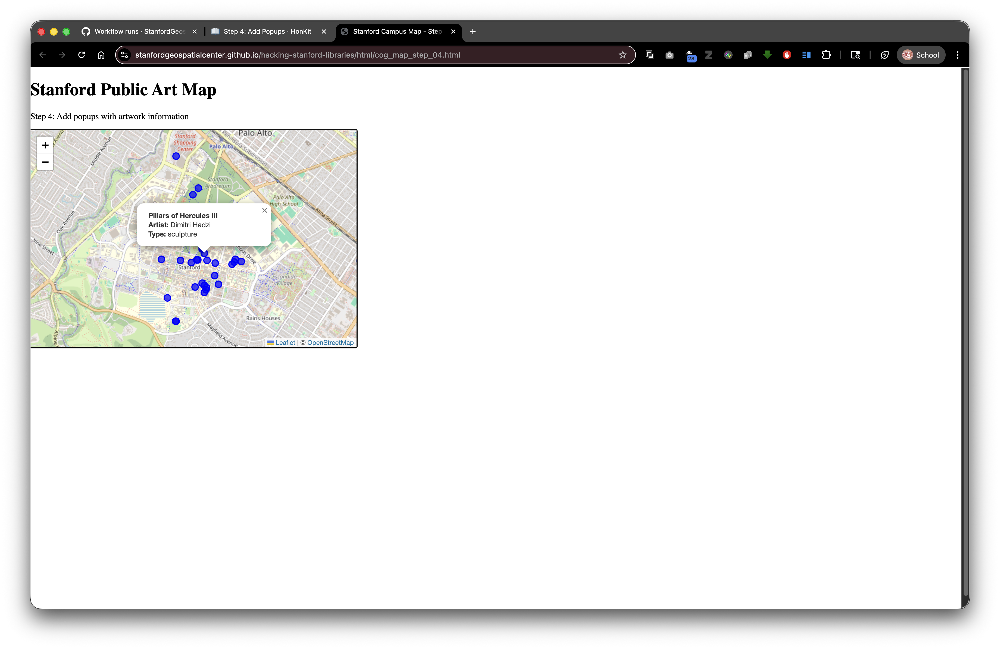

# Step 4: Add Popups with Information

Live Demo: [html/cog_map_step_04.html](html/cog_map_step_04.html)



## Overview

In this step, we'll make our map interactive by adding popups that display artwork information when users click on markers. This introduces working with feature properties and building dynamic HTML content.

## Learning Objectives

- Bind popups to markers
- Access feature properties (attributes)
- Build HTML content dynamically with JavaScript
- Understand the `onEachFeature` callback
- Create user-friendly information displays

## What are Popups?

**Popups** are small information windows that appear when you click on map features.

**Think of them like:** Tooltips or info cards that provide details about what you clicked.

**Why use popups:**
- Show detailed information without cluttering the map
- Make maps interactive and explorable
- Provide context about geographic features
- Create a better user experience

## The Complete Code

```html
<!DOCTYPE html>
<html lang="en">
<head>
    <base target="_top">
    <meta charset="utf-8">
    <meta name="viewport" content="width=device-width, initial-scale=1">
    <title>Stanford Campus Map - Step 4: Add Popups</title>

    <link rel="stylesheet" href="https://unpkg.com/leaflet@1.9.4/dist/leaflet.css" integrity="sha256-p4NxAoJBhIIN+hmNHrzRCf9tD/miZyoHS5obTRR9BMY=" crossorigin=""/>
    <script src="https://unpkg.com/leaflet@1.9.4/dist/leaflet.js" integrity="sha256-20nQCchB9co0qIjJZRGuk2/Z9VM+kNiyxNV1lvTlZBo=" crossorigin=""></script>

    <style>
        html, body {
            height: 100%;
            margin: 0;
        }
        .leaflet-container {
            height: 400px;
            width: 600px;
            max-width: 100%;
            max-height: 100%;
        }
    </style>
</head>
<body>

<h1>Stanford Public Art Map</h1>
<p>Step 4: Add popups with artwork information</p>

<div id="map" style="width: 600px; height: 400px;"></div>
<script>

    // Initialize map centered on Stanford campus
    const map = L.map('map').setView([37.427, -122.169], 15);

    // Add OpenStreetMap tile layer
    const tiles = L.tileLayer('https://tile.openstreetmap.org/{z}/{x}/{y}.png', {
        maxZoom: 19,
        attribution: '&copy; <a href="http://www.openstreetmap.org/copyright">OpenStreetMap</a>'
    }).addTo(map);

    // Load GeoJSON data
    fetch('collection/stanford_public_art.geojson')
        .then(response => response.json())
        .then(data => {
            // Add GeoJSON layer with custom circle markers and popups
            const artworkLayer = L.geoJSON(data, {
                pointToLayer: function(feature, latlng) {
                    return L.circleMarker(latlng, {
                        radius: 6,
                        color: 'blue',
                        weight: 2,
                        fillColor: 'blue',
                        fillOpacity: 0.7
                    });
                },
                onEachFeature: function(feature, layer) {
                    const props = feature.properties || {};
                    const title = props.name || 'Artwork';
                    const artist = props.artist_name;
                    const type = props.artwork_type;
                    
                    // Build popup content
                    let popupContent = '<div style="min-width:200px;">';
                    popupContent += '<b>' + title + '</b><br>';
                    if (artist) popupContent += '<b>Artist:</b> ' + artist + '<br>';
                    if (type) popupContent += '<b>Type:</b> ' + type;
                    popupContent += '</div>';
                    
                    layer.bindPopup(popupContent);
                }
            }).addTo(map);

            // Zoom to fit all markers
            map.fitBounds(artworkLayer.getBounds());
        })
        .catch(error => console.error('Error loading GeoJSON:', error));

</script>

</body>
</html>
```

## What's New?

### 1. The onEachFeature Callback

```javascript
onEachFeature: function(feature, layer) {
    // This runs for each feature in your GeoJSON
}
```

**What is `onEachFeature`?** A function that runs once for every feature (point, line, polygon) in your GeoJSON.

**When to use it:**
- Bind popups or tooltips
- Attach event listeners (clicks, hovers)
- Style individual features based on their properties
- Add custom behavior to features

**Parameters:**
- **`feature`** - The GeoJSON feature (with geometry and properties)
- **`layer`** - The Leaflet layer that was created for this feature (the circle marker)

**Execution:** If you have 50 artworks in your GeoJSON, this function runs 50 times (once per artwork).

### 2. Accessing Feature Properties Safely

```javascript
const props = feature.properties || {};
const title = props.name || 'Artwork';
const artist = props.artist_name;
const type = props.artwork_type;
```

**Breaking it down:**

**Line 1: Get properties safely**
```javascript
const props = feature.properties || {};
```

**The `||` operator** means "or" - if `feature.properties` doesn't exist, use an empty object `{}` instead.

**Why?** Prevents errors if a feature is missing properties.

**Line 2: Get name with fallback**
```javascript
const title = props.name || 'Artwork';
```

If `props.name` doesn't exist or is empty, use the default value `'Artwork'`.

**Lines 3-4: Get other properties**
```javascript
const artist = props.artist_name;
const type = props.artwork_type;
```

These might be `undefined` if the properties don't exist - we'll handle that next.

### 3. Building HTML Content Dynamically

```javascript
let popupContent = '<div style="min-width:200px;">';
popupContent += '<b>' + title + '</b><br>';
if (artist) popupContent += '<b>Artist:</b> ' + artist + '<br>';
if (type) popupContent += '<b>Type:</b> ' + type;
popupContent += '</div>';
```

**What's happening:** We're building an HTML string piece by piece.

**Line by line:**

**1. Start with a div wrapper:**
```javascript
let popupContent = '<div style="min-width:200px;">';
```
- `let` - A variable that can change (we'll add more content)
- `<div style="min-width:200px;">` - Container with minimum width (so popups aren't too narrow)

**2. Add the title (always shown):**
```javascript
popupContent += '<b>' + title + '</b><br>';
```
- `+=` - Append to the existing string
- `<b>` - Bold HTML tag
- `+` - String concatenation (joining text together)
- `<br>` - Line break (new line)

**3. Conditionally add artist (only if it exists):**
```javascript
if (artist) popupContent += '<b>Artist:</b> ' + artist + '<br>';
```
- `if (artist)` - Only run this if `artist` has a value (not undefined, not empty)
- This prevents showing "Artist: undefined"

**4. Conditionally add type:**
```javascript
if (type) popupContent += '<b>Type:</b> ' + type;
```

**5. Close the div:**
```javascript
popupContent += '</div>';
```

**Result:** A string of HTML like:
```html
<div style="min-width:200px;">
  <b>The Sieve of Eratosthenes</b><br>
  <b>Artist:</b> Mark di Suvero<br>
  <b>Type:</b> sculpture
</div>
```

### 4. Binding the Popup

```javascript
layer.bindPopup(popupContent);
```

**What this does:** Attaches the HTML content as a popup to this marker.

**`layer`** - The circle marker we created in `pointToLayer`

**When clicked:** The popup opens automatically showing the HTML content.

**Leaflet handles:**
- Opening/closing the popup
- Positioning it near the marker
- Closing other popups when a new one opens
- Adding a close button

## String Concatenation vs. Template Literals

The code above uses **string concatenation** with `+`:

```javascript
'<b>Artist:</b> ' + artist + '<br>'
```

**Modern alternative: Template literals** (easier to read):

```javascript
`<b>Artist:</b> ${artist}<br>`
```

**Template literal features:**
- Surrounded by backticks `` ` `` (not quotes)
- Variables inserted with `${variableName}`
- Can span multiple lines
- More readable for complex HTML

**Our popup rewritten with template literals:**

```javascript
const popupContent = `
  <div style="min-width:200px;">
    <b>${title}</b><br>
    ${artist ? `<b>Artist:</b> ${artist}<br>` : ''}
    ${type ? `<b>Type:</b> ${type}` : ''}
  </div>
`;
```

**The ternary operator:** `condition ? valueIfTrue : valueIfFalse`

## Enhancing Popups with Styling

You can add inline CSS to make popups look better:

```javascript
let popupContent = `
  <div style="
    min-width: 200px;
    font-family: Arial, sans-serif;
    padding: 10px;
  ">
    <h3 style="
      margin-top: 0;
      color: #1a73e8;
      font-size: 16px;
    ">${title}</h3>
    <p style="margin: 5px 0;">
      <strong>Artist:</strong> ${artist || 'Unknown'}
    </p>
    <p style="margin: 5px 0;">
      <strong>Type:</strong> ${type || 'Not specified'}
    </p>
  </div>
`;
```

## Advanced: Adding Links to Digital Stacks

If your GeoJSON includes DRUIDs, you can link to the full record:

```javascript
const druid = props.druid;
const purlUrl = `https://purl.stanford.edu/${druid}`;

let popupContent = `
  <div style="min-width:200px;">
    <b>${title}</b><br>
    ${artist ? `<b>Artist:</b> ${artist}<br>` : ''}
    ${druid ? `<a href="${purlUrl}" target="_blank">View in SDR</a>` : ''}
  </div>
`;
```

**This creates a clickable link** that opens the PURL page in a new tab.

## Adding Images to Popups

If you have image URLs in your GeoJSON properties:

```javascript
const imageUrl = props.image_url;

let popupContent = `
  <div style="min-width:250px;">
    ${imageUrl ? `` : ''}
    <b>${title}</b><br>
    ${artist ? `<b>Artist:</b> ${artist}<br>` : ''}
  </div>
`;
```

**For Digital Stacks images:**
```javascript
const imagePath = props.image_filename;
const imageUrl = `https://stacks.stanford.edu/file/druid:${props.druid}/${imagePath}`;
```

## Try It Yourself

1. **Copy the complete code** into `step-04.html`
2. **Open in your browser**
3. **Click on any blue circle**

You should see a popup with artwork information!

### Experiments

**Add more properties from your GeoJSON:**
```javascript
const material = props.material;
const year = props.inception;

if (material) popupContent += `<b>Material:</b> ${material}<br>`;
if (year) popupContent += `<b>Year:</b> ${year}<br>`;
```

**Style the popup with colors:**
```javascript
popupContent = `
  <div style="
    background: linear-gradient(135deg, #667eea 0%, #764ba2 100%);
    color: white;
    padding: 15px;
    border-radius: 8px;
  ">
    <h3 style="margin:0 0 10px 0;">${title}</h3>
    <p style="margin:5px 0;"><strong>Artist:</strong> ${artist}</p>
  </div>
`;
```

**Add emoji icons:**
```javascript
popupContent = `
  <div style="min-width:200px;">
    <h3>${title}</h3>
    ${artist ? `<b>Artist:</b> ${artist}<br>` : ''}
    ${type ? `<b>Type:</b> ${type}` : ''}
  </div>
`;
```

## Popups in SDR Context

When you deposit your map to SDR:

1. **Popup content works exactly the same** - it's just HTML strings
2. **Relative image references** in popups need care:
   ```javascript
   const imageUrl = `images/${props.image_file}`;  // Relative path
   ```
3. **External links work fine** (Wikidata, PURLs, etc.)
4. **Can reference other DRUIDs** in popup links

**Example combining local and external data:**
```javascript
const localImage = `images/${props.filename}`;  // From your deposit
const externalLink = `https://purl.stanford.edu/${props.related_druid}`;  // Another SDR object

popupContent = `
  
  <a href="${externalLink}" target="_blank">Related Collection</a>
`;
```

## Common Mistakes

**❌ Forgetting to check if properties exist:**
```javascript
popupContent += '<b>Artist:</b> ' + artist + '<br>';
// Shows "Artist: undefined" if artist doesn't exist
```

**Check first:**
```javascript
if (artist) popupContent += '<b>Artist:</b> ' + artist + '<br>';
```

**❌ Not closing HTML tags:**
```javascript
popupContent = '<div><b>' + title;  // Missing closing tags
```

**❌ Quotes inside quotes:**
```javascript
popupContent = "<div style="color:red">Text</div>";  // Breaks!
```

**Use different quote types:**
```javascript
popupContent = '<div style="color:red">Text</div>';  // Works!
popupContent = `<div style="color:red">Text</div>`;  // Also works!
```

## What's Next?

In [Step 5: Cloud Optimized GeoTIFF from Digital Stacks](06-step-05-cog-from-stacks.md), we'll add high-resolution aerial imagery from the Stanford Digital Repository!

## Key Takeaways

- `onEachFeature` runs once for each feature in your GeoJSON  
- `layer.bindPopup()` attaches popup content to markers  
- Check if properties exist with `if (variable)` before using them  
- Build HTML strings dynamically with concatenation or template literals  
- `||` operator provides default values  
- Popups can include HTML, styling, images, and links  
- Works perfectly with SDR deposits using relative paths  

## Common Questions

**Q: Can I have multiple popups open at once?**  
A: By default, Leaflet closes other popups when opening a new one. You can change this with `autoClose: false` in the popup options.

**Q: How do I make popups open on hover instead of click?**  
A: Use `layer.bindTooltip()` instead of `layer.bindPopup()`, or add hover event listeners.

**Q: Can I add buttons or interactive elements in popups?**  
A: Yes! You can include any HTML, including buttons with onclick handlers.

**Q: How do I control popup width?**  
A: Set `minWidth` and `maxWidth` in the popup options, or use CSS in your HTML content.

---

**Previous:** [Step 3: GeoJSON Points](04-step-03-geojson-points.md) | **Next:** [Step 5: COG from Digital Stacks](06-step-05-cog-from-stacks.md)
